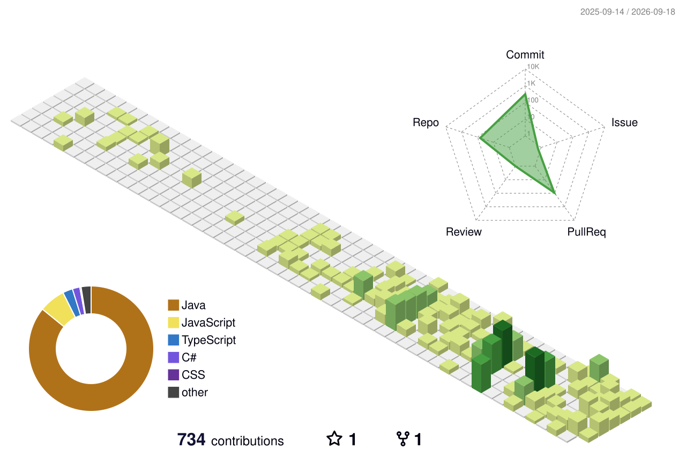

  <h2>MIKAYIL GULIYEV</h2>
  <h4>Software Developer</h4>
  
  

  

    
    
  

---

### 🏆 GITHUB TROPHIES

  

### 👨‍💻 PROFESSIONAL SUMMARY

Driven Software Developer with a strong foundation in designing and developing scalable distributed systems. Experienced in building microservices architectures, optimizing backend logic, and implementing CI/CD pipelines. Highly passionate about continuous learning, modern cloud-native technologies, and engineering reliable solutions.

### 🛠️ TECHNICAL ARSENAL

  

---

### 📈 CONTRIBUTION METRICS

  

 

  

---

### 🐍 CONTRIBUTION SNAKE

  

### 🌆 3D CONTRIBUTION CITY

  

