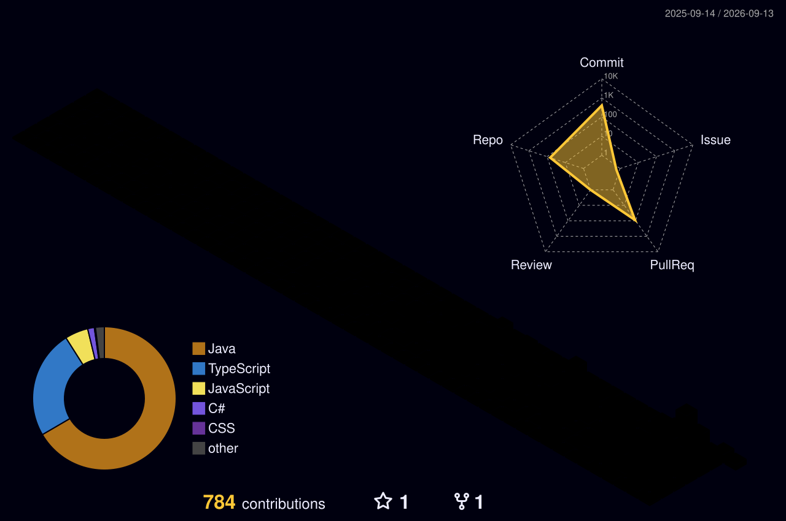

<h1 align="center">Hi 👋, I'm Mikayil Quliyev</h1>
<h3 align="center">A passionate Full-Stack Developer from Azerbaijan 🇦🇿</h3>

  

---

### 🚀 About Me
- 🏢 I’m currently building **WayGo**, an innovative navigation and traffic platform.
- 💻 I love working with **React, TypeScript, Java (Spring Boot), and Python**.
- 📚 I’m currently learning advanced **AI, Data Structures & System Architecture**.
- 🤝 I’m looking to collaborate on **Open Source projects** and impactful software.
- 📬 How to reach me: **mikayilquliyev16@gmail.com**

### 🛠️ Languages and Tools

  

---

### 📊 My GitHub Stats

  
  

### 🌆 My 3D Contribution City

  

